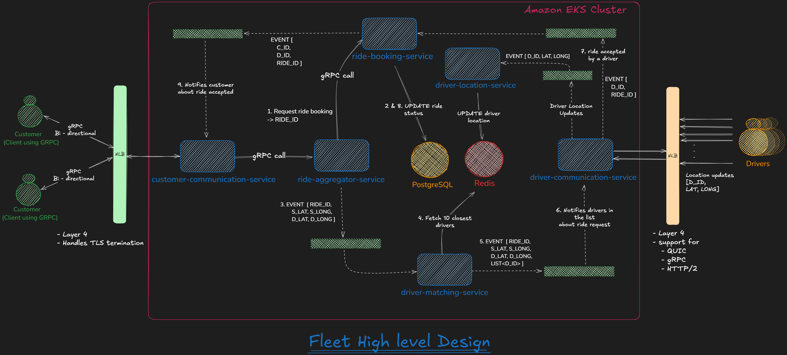
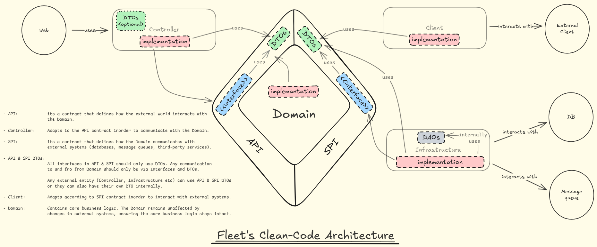

# Fleet 🚖
Fleet is my attempt at building a functional and scalable cab aggregator application while honing my problem-solving and decision-making abilities. Every technical and architectural choice comes with trade-offs, and I aim to document each one, providing insights into the challenges and solutions involved in building such a platform. This project is a continuous work in progress, evolving as I acquire new knowledge and skills.


## Why Fleet Uses GPL 3.0 📜
Fleet is licensed under GPL 3.0 to promote open collaboration and ensure that any modifications or improvements made by others remain open-source. This aligns with the project's goal of learning and sharing knowledge while fostering a community-driven development approach.


## Requirements 📝

### Functional Requirements
Fleet must provide the following core functionalities to ensure a seamless user experience:
- **Real-Time Driver Location Tracking**: Continuously track and update driver locations.
- **Ride Booking**: Allow users to book rides, view ride details and ride status.


### Non-Functional Requirements
To ensure the system is robust, scalable, and maintainable, the following non-functional requirements must be met:
- **High Performance**:
  - Low response time for API calls.
  - Low latency for real-time updates.
  - High throughput to handle multiple concurrent requests.
- **Scalability**:
  - Support horizontal scaling to handle increased traffic.
  - Database design must support partitioning and sharding for efficient data management.
- **Maintainability**:
  - Follow modular design principles for easier updates and debugging.
  - Ensure clean architecture and clean code practices.
- **Monitoring and Logging**:
  - Log all critical events for debugging.
  - Use tools like OpenTelemetry for real-time monitoring and observability.


## Architecture 🏗️

### Microservices

#### 1. Customer Communication Service
**Purpose:** Facilitates real-time, bi-directional communication by maintaining connections with customers.
**Techstack:** Spring Boot, gRPC  
**Infra:** None  
**Key Decisions:**
- Chose gRPC over REST to boost performance.  
- Enables bi-directional streaming for efficient, real-time data exchange.

#### 2. Ride Aggregator Service
**Purpose:** Acts as an aggregator service, `Customer Communication Service` will call `ride-aggregator-service` which inturns coordinates with other microservices to fullfill the request.  
**Techstack:** Spring Boot, gRPC  
**Infra:** Kafka  
**Key Decisions:**
- Utilizes Kafka for asynchronous processing, except when interacting with the `ride-booking-service` where immediate database updates via gRPC are essential.  
- Simplifies the client-side by consolidating multiple service calls into a single API endpoint.

#### 3. Ride Booking Service
**Purpose:** Manages ride status updates and maintains persistent ride data.  
**Techstack:** Spring Boot, gRPC  
**Infra:** PostgreSQL  
**Key Decisions:**
- Utilizes PostgreSQL to persist ride details

#### 4. Driver Matching Service
**Purpose:** Fetches the 10 closest drivers for a ride request.  
**Techstack:** Spring Boot  
**Infra:** Redis  
**Key Decisions:**
- Utilizes Redis for quick access to driver locations.

#### 5. Driver Connection Service
**Purpose:** Maintains connections with drivers and facilitates real-time communication.  
**Techstack:** gRPC, QUIC  
**Infra:** Kafka  
**Key Decisions:**
- Uses NLB (Layer 4) instead of ALB for persistent low-latency connections.
- Uses gRPC for ride acceptance/decline and QUIC for efficient location updates.
- Offloads incoming location updates to Kafka for asynchronous processing.

#### 6. Driver Location Service
**Purpose:** Listens to driver location updates and persists them in Redis.  
**Techstack:** Spring Boot, Kafka, Redis  
**Infra:** Redis, Kafka  
**Key Decisions:**
- Utilizes Kafka for scalable ingestion of location updates.
- Utilizes Redis to store frequently changing location data efficiently.


### Infrastructure Components

### Diagrams

### High-Level Design (HLD)



*Figure 1: High-Level Design for Fleet*


### Clean Code Architecture



*Figure 2: Clean Code Architecture for Fleet*

### Microservice Design Decisions
This section outlines the key decisions made for each microservice in the Fleet application:

#### 1. Why Event-Driven Architecture?
**Pros:**
- Decouples entire system into small microservices.
- Highly scalable.
- Fault tolerance.
- Reduces synchronous dependencies.

**Cons:**
- Operational complexity.

**Final Decision:**
Fleet heavily relies on real-time updates and scale-out capabilities, making event-driven architecture the optimal choice.


#### 2. Why Amazon EKS?
**Pros:**
- Managed Kubernetes service reduces operational overhead.
- Seamless integration with AWS ecosystem (ALB, NLB, etc.).
- Autoscaling and high availability built-in.

**Cons:**
- Requires knowledge of AWS ecosystem.
- Vendor lockdown.

**Final Decision:**
EKS provides a fully managed Kubernetes environment with enterprise-level scalability, making it ideal for our microservices.


<del>

#### 3. Why Customer-Facing Load Balancer is ALB, Not NLB?
**Pros of ALB:**
- Supports HTTP/2 and gRPC routing.
- Provides TLS termination, simplifying microservices.

**Cons of NLB:**
- Lacks HTTP routing capabilities.
- Requires backend services to manage TLS termination.

**Final Decision:**
ALB is used for customer-facing traffic as it supports TLS termination and HTTP-based routing efficiently.

</del>

**-> Customer-Facing Load Balancer is now NLB, as AWS NLB supports TLS termination**


<del>

#### 4. TLS Termination at ALB (Not API Gateway)?
**Pros of ALB TLS Termination:**
- Offloads TLS management, reducing API Gateway load.
- Simplifies client integration as only ALB needs certificates.

**Cons:**


**Final Decision:**
ALB handles TLS termination to simplify infrastructure and offload certificate management from the backend.

</del>

**-> Reduced sope of the project. Hence, API Gateway is removed**


<del>

#### 5. Why API Gateway?
**Pros:**
- Future-proofing for authentication, rate limiting, and caching.
- Protocol translation for improved efficiency.

**Cons:**
- Adds an extra hop, increasing latency.

**Final Decision:**
API Gateway provides flexibility and scalability, making it essential for managing client-facing requests.

</del>

**-> Reduced sope of the project. Hence, API Gateway is removed**


#### 6. Why Aggregator Service?
**Pros:**
- A single API call is required instead of calling individual microservices.
- Handles failures.

**Cons:**
- Adds an extra layer of processing.

**Final Decision:**
Aggregator service enables a more maintainable, modular architecture and helps to handle failures if a microservice fails to respond.


<del>

#### 7. Why API Gateway, Aggregator, and Ride Booking Service Use gRPC Instead of Kafka?
**Pros**
- Low-latency, high-performance communication.
- Synchronous request-response handling for ride bookings.

**Cons**

**Final Decision:**
gRPC is used for request-response flows, while Kafka is used for event-driven processes.

</del>

**-> Reduced sope of the project. Hence, API Gateway is removed. Driver communication service uses gRPC to co-ordinate with Aggregator service due to Low-latency, high-performance,  Synchronous request-response handling needs.**


#### 8. Why Redis for Storing Frequent Driver Locations?
**Pros:**
- Low-latency data access.
- Supports high-throughput reads and writes.

**Cons:**

**Final Decision:**
Redis is ideal for frequently changing data like driver locations due to its speed and efficiency.


#### 9. Why PostgreSQL for Customer, Driver, and Ride Details?
**Pros:**
- ACID compliance ensures data consistency.
- Optimal to storage relational data.
- Supports complex queries efficiently.

**Cons:**
- Requires careful schema design and indexing to maintain performance at scale.
- Less flexible for handling unstructured or rapidly evolving data models.

**Final Decision:**
PostgreSQL offers full ACID compliance, robust community support, and is one of the most reliable and well-established relational databases available.


#### 10. Why We Ditch WebSockets and Use gRPC + QUIC?
**Pros of gRPC + QUIC:**
- gRPC (ride accept/decline) ensures low-latency bidirectional communication. TCP based so gurantees message delivery.
- QUIC (location updates) is optimized for real-time streaming over UDP. its okay if a packet gets lost.

**Cons of WebSockets:**
- Higher overhead compared to QUIC.
- Less efficient for mobile networks.

**Final Decision:**
gRPC + QUIC provides the best combination of efficiency and performance for real-time communication.


#### 11. Why NLB for Driver Connections Instead of ALB?
**Pros of NLB:**
- Lower latency, better suited for persistent connections.
- Supports both TCP and UDP (required for gRPC and QUIC).
- Supports TLS termination.

**Cons of ALB:**
- Poor support for long-lived connections.

**Final Decision:**
NLB is used for driver connections to ensure low-latency, persistent communication channels.


#### 12. Why Customer Communication Service Uses gRPC 
**Pros of gRPC for Bidirectional Communication:**
- Enables low-latency, high-performance, bidirectional streaming ideal for real-time customer interactions.
- Provides efficient and reliable message exchange between clients and the service.

**Final Decision:**
Using gRPC for bidirectional communication ensures robust, real-time, fast & reliable communication


## Challenges Faced 🧗
Building Fleet came with its own set of challenges, which provided valuable learning opportunities:


## Learnings Along the Way 📚
Developing Fleet has been a rewarding experience, offering numerous insights and learnings:

1. **Formatting** was a big challenge and wanted to maintain consistent formatting. Found **Spotless Maven Plugin** that solves most of the issues, and we can specify formatting for various types of languages.
  - Links referred:
    - [Baeldung: Spotless Maven Plugin](https://www.baeldung.com/java-maven-spotless-plugin)
    - [GitHub: Spotless Maven Plugin](https://github.com/diffplug/spotless/blob/main/plugin-maven/README.md)

2. **gRPC** was chosen for its high-performance, low-latency communication capabilities. It supports bidirectional streaming and is well-suited for real-time systems like Fleet. Implementing gRPC required understanding protocol buffers and setting up efficient service definitions. It significantly improved the system's responsiveness and scalability.
  - Links referred:
    - [gRPC vs REST](https://blog.postman.com/grpc-vs-rest/)
    - [gRPC Official Documentation](https://grpc.io/docs/)
    - [Protocol Buffers Documentation](https://protobuf.dev/)

3. **QUIC** was selected for its modern, low-latency, and reliable transport protocol, especially suited for real-time streaming and mobile networks. QUIC operates over UDP, providing faster connection establishment, improved congestion control, and better performance in lossy network conditions compared to traditional TCP. This choice significantly enhanced the system's ability to deliver real-time data with minimal delay, even on unreliable networks.
  - Links referred:
    - [The QUIC Transport Protocol: Design and Internet-Scale Deployment (Google Research)](https://research.google/pubs/the-quic-transport-protocol-design-and-internet-scale-deployment/)
    - [Cloudflare Blog: The Road to QUIC](https://blog.cloudflare.com/the-road-to-quic/)

4. **PostgreSQL** was chosen for its robust ACID compliance, strong support for relational data, and mature ecosystem. PostgreSQL excels at handling complex queries and ensures data consistency. Its reliability and extensive community support make it a solid choice.
  - Links referred:
    - [Fundamentals of Database Engineering](https://www.udemy.com/course/database-engines-crash-course/)
  
5. **Formatting Protobuf Files** Formatting protobuf files with maven-spotless plugin was challenging as it required the `buf` CLI path to be provided. The main issue arose when running this setup in a cross-platform environment, as Maven does not support conditional logic like `if-else` clauses. One workaround would be Maven profiles, but its unnecessary complexity. Instead, I chose to use **pre-commit hooks**, which offered several advantages:
  - Ability to format Protobuf files.
  - Additional features like secret detection, syntax correction, and validation for YAML and JSON files.

  - Links referred:
    - https://github.com/diffplug/spotless/blob/main/plugin-maven/README.md#protobuf
    - https://pre-commit.com/#usage
    - https://pre-commit.com/#plugins

## Installation 🛠️

### Prerequisites
- Java (v17)
- Apache Maven (v3.9.9 or higher)
- Docker (v27.3.1 or higher)
- Docker compose (v2.30.3-desktop.1 since im using windows)
- Python (v3.8.10)

### Steps to Build the Application
To build the Fleet application, execute the following command:
```bash
# Clean and build the application
mvn clean install
```

### Steps to Run Pre-Commit Hooks
Follow these steps to ensure pre-commit hooks are installed and executed correctly:

1. **If Pre-Commit is Already Installed**:
  Run the following commands:
  ```bash
  pre-commit install
  pre-commit run --all
  ```

2. **If Pre-Commit is Not Installed**:
  Ensure you are using Python 3.8.10 (newer Python and pre-commit versions may have compatibility issues). Then, execute:
  ```bash
  pip install -r requirements.txt
  pre-commit install
  pre-commit run --all
  ```

3. **If Using Windows and Pre-Commit Command is Not Found**:
  Verify your Python version by running:
  ```bash
  python3 --version
  ```
  Ensure the output is:
  ```
  Python 3.8.10
  ```

  Then, use the following commands to install and run pre-commit hooks:
  ```bash
  python3 -m pre_commit install
  python3 -m pre_commit run --all
  ```

4. **Auto update Pre-Commit Hooks**:
```bash
pre-commit autoupdate
```
or
```bash
python3 -m pre_commit autoupdate
```

----


### Steps to Run the Application

----

## Contributing 🤝
- Direct pushes to the `main` branch are protected and not allowed. All changes must go through a pull request.
- Once a pull request is merged, the corresponding branch will be deleted to keep the repository clean.

Contributions are welcome! Please follow these steps:
1. Fork the repository.
2. Create a new branch for your feature or bug fix.
3. Commit your changes and push them to your fork.
4. Submit a pull request with a detailed description of your changes.
