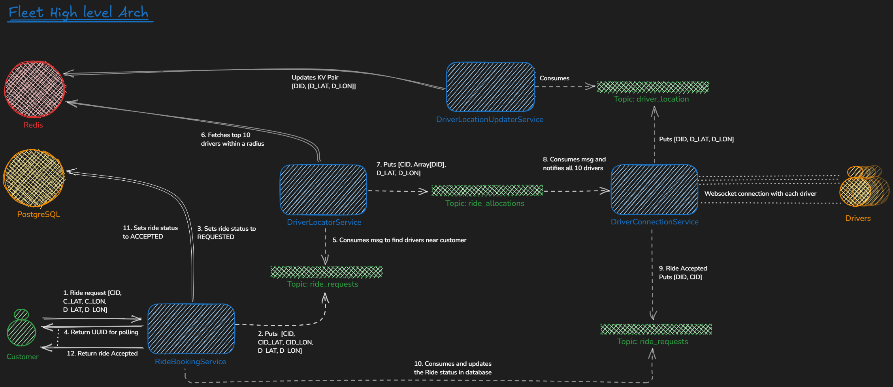
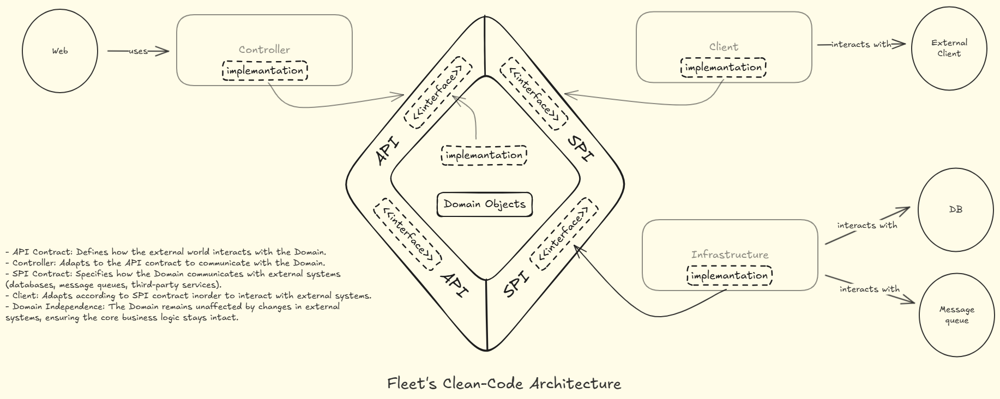

# Fleet
Fleet is a Bike &amp; Cab aggregator application.

---

## Fleet HLD
<p align="center">
    
    <br/>
    The high-level diagram depicts Fleet's overall microservice architecture.
</p>

---

## Fleet's Clean-Code Architecture
<p align="center">
    
    <br/>
    The diagram illustrates the clean code architecture principles to be adhered to when developing for Fleet.
</p>

---

### Prerequisites
1. Code editor, Java, Maven, docker setup done.
2. If buf cli isnt installed refer: https://github.com/bufbuild/buf/releases
3. in my windows laptop, I installed buf-Windows-x86_64.exe, renamed it to buf.exe and created a new folder C:\Program Files (x86)\Buf and pasted it there, added it in environment variable.
4. `buf --version` should work. copy the version and edit the property <bufbuild.buf> in parent pom.xml
5. if in windows and using 1.50.0 buf cli version then you might need to add a custom command

    diff.bat
    ```
    @echo off
    fc %1 %2
    ```
6. For unix make sure your buf is installed in /usr/local/bin/buf path

---

### Run
1. Compile the project:
    - Windows
    ```
    cd tools\build
    sh compile.sh
    ```
    - Linux
    ```
    cd tools/build
    ./compile.sh
    ```

---

### Challenges faced
1. Formatting was a big challenge and wanted to maintain consitent formatting, found spotless maven plugin that solves most of the things and we can specify formatting for even various types of lang
    - links referred:
        - https://www.baeldung.com/java-maven-spotless-plugin
        - https://github.com/diffplug/spotless/blob/main/plugin-maven/README.md

2. installing buf cli was necessary to make spotless mvn plugin format proto files
    - First error ran into was `Possible causes of java.io.IOException: CreateProcess error=5`
    for which i missed adding buf.exe in `<pathToExe>C:\Program Files (x86)\Buf\buf.exe</pathToExe>`
        - link referred: https://stackoverflow.com/questions/6674431/possible-causes-of-java-io-ioexception-createprocess-error-5
    - Second error was that for some reason buf.exe (windows executable) was expecting diff (linux command) for this i used a hacky way to create my own custom command and internally used fc (windows command to compare files)
    
        diff.bat
        ```
        @echo off
        fc %1 %2
        ```

3. Issues with mvn dependency management, this blog helped to understand things in better way
    - link referred: 
        - https://maven.apache.org/guides/introduction/introduction-to-dependency-mechanism.html#Importing_Dependencies
        - https://stackoverflow.com/questions/921599/declare-dependency-in-dependencymanagement-section-even-if-dependency-not-used

4. We store all our proto files in fleet-protobuf, if any module needs any proto file from it then we have maven plugin that copies the file into module's subfolder. The issue was Github CI was failing because it was unable to find the proto files in modules subfolder. which was very awkward because in my local things were fine and build was success. 
    - RCA: Compilation of proto was happening before copying of proto files in module's subfolder. It wasnt caught in local mainly because in my .vscode, setting.json
    ```
    {
        "java.configuration.updateBuildConfiguration" : "automatic"
    }   
    ```
    This was causing automatic trigger of pom.xml which was beforehand copying files rather doing it in runtime. This was caught by github CI. because it doesnt have automatic build configuration which vscode does :)
