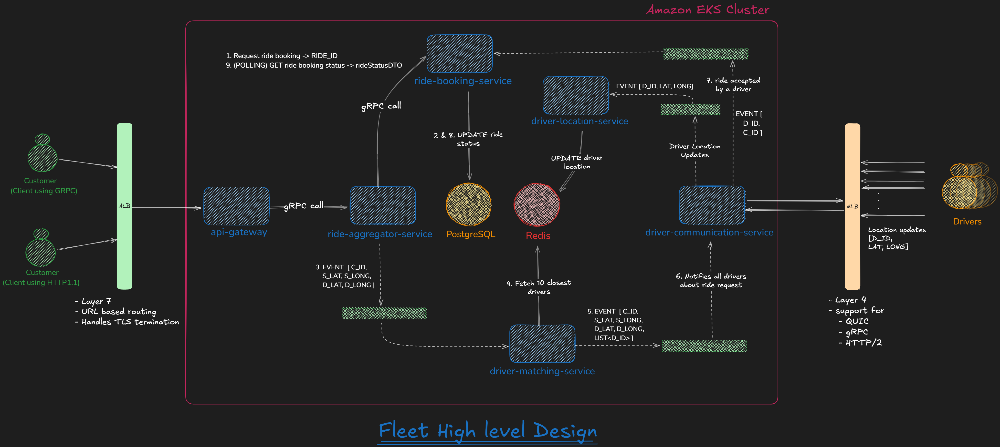

# Fleet
Fleet is my attempt at building a functional and scalable cab aggregator application while honing my problem-solving and decision-making skills. Every technical and architectural choice comes with trade-offs, and I aim to document each one, providing insights into the challenges and solutions involved in building such a platform.

## Why Fleet Uses GPL 3.0
Fleet is licensed under GPL 3.0 to promote open collaboration and ensure that any modifications or improvements made by others remain open-source. This aligns with the project's goal of learning and sharing knowledge while fostering a community-driven development approach.

## Requirements

### Functional Requirements
Fleet must provide the following core functionalities to ensure a seamless user experience:
- **Real-Time Driver Location Tracking**: Continuously track and update driver locations.
- **Ride Booking**: Allow users to book rides, view ride details and ride status.
- **Ride Allocation System**: Implement a system to allocate rides efficiently.

### Non-Functional Requirements
To ensure the system is robust, scalable, and maintainable, the following non-functional requirements must be met:
- **High Performance**: 
  - Low response time for API calls.
  - Low latency for real-time updates.
  - High throughput to handle multiple concurrent requests.
- **Scalability**: 
  - Support horizontal scaling to handle increased traffic.
  - Database design must support partitioning and sharding for efficient data management.
- **Maintainability**: 
  - Follow modular design principles for easier updates and debugging.
  - Ensure clean architecture and clean code practices.
- **Monitoring and Logging**: 
  - Log all critical events for debugging.
  - Use tools like OpenTelemetry for real-time monitoring and observability.

## Architecture

### Microservices

#### 1. API Gateway
**Purpose:** Acts as an entry point for customer requests, handling protocol translation, rate limiting.
**Techstack:** Spring Boot, gRPC
**Infra:** None
**Key Decisions:**
- Enables future enhancements like authentication, caching, and rate limiting, protocol translation without modifying backend services.
- Uses gRPC instead of REST to communicate with `ride-aggregator-service` for better performance.

#### 2. Ride Aggregator Service
**Purpose:** Acts as an aggregator service, `API Gateway` will call ride-aggregator-service which inturns coordinates with other microservices to fullfill the request.
**Techstack:** Spring Boot, gRPC
**Infra:** Kafka
**Key Decisions:**
- Uses Kafka for asynchronous processing except for interactions with `ride-booking-service` which require gRPC for immediate updates.
- Allows separation of concerns by abstracting business logic from API Gateway.

#### 3. Ride Booking Service
**Purpose:** Manages ride status updates and maintains persistent ride data.
**Techstack:** Spring Boot, gRPC
**Infra:** PostgreSQL
**Key Decisions:**
- Uses PostgreSQL to persist ride details

#### 4. Driver Matching Service
**Purpose:** Fetches the 10 closest drivers for a ride request.
**Techstack:** Spring Boot
**Infra:** Redis
**Key Decisions:**
- Uses Redis for quick access to driver locations.

#### 5. Driver Connection Service
**Purpose:** Maintains active connections with drivers and facilitates real-time communication.
**Techstack:** gRPC, QUIC
**Infra:** Kafka
**Key Decisions:**
- Uses NLB (Layer 4) instead of ALB for persistent low-latency connections.
- Uses gRPC for ride acceptance/decline and QUIC for efficient location updates.
- Offloads incoming location updates to Kafka for asynchronous processing.

#### 6. Driver Location Service
**Purpose:** Listens to driver location updates and persists them in Redis.
**Techstack:** Spring Boot, Kafka, Redis
**Infra:** Redis, Kafka
**Key Decisions:**
- Uses Kafka for scalable ingestion of location updates.
- Uses Redis to store frequently changing location data efficiently.

### Infrastructure Components

### Diagrams

### High-Level Design (HLD)

*Figure: High-Level Design for Fleet*

### Microservice Design Decisions
This section outlines the key decisions made for each microservice in the Fleet application:

#### 1. Why Event-Driven Architecture?
**Pros:**
- Decouples entire system into small microservices.
- Highly scalable.
- Fault tolerance.
- Reduces synchronous dependencies.

**Cons:**
- Operational complexity.
- Eventual consistency issues in some scenarios.

**Final Decision:**
Fleet heavily relies on real-time updates and scale-out capabilities, making event-driven architecture the optimal choice.

#### 2. Why Amazon EKS?
**Pros:**
- Managed Kubernetes service reduces operational overhead.
- Seamless integration with AWS ecosystem (ALB, NLB, etc.).
- Autoscaling and high availability built-in.

**Cons:**
- Requires knowledge of AWS ecosystem.
- Vendor lockdown.

**Final Decision:**
EKS provides a fully managed Kubernetes environment with enterprise-level scalability, making it ideal for our microservices.

#### 3. Why Customer-Facing Load Balancer is ALB, Not NLB?
**Pros of ALB:**
- Supports HTTP/2 and gRPC routing.
- Provides TLS termination, simplifying microservices.

**Cons of NLB:**
- Lacks HTTP routing capabilities.
- Requires backend services to manage TLS termination.

**Final Decision:**
ALB is used for customer-facing traffic as it supports TLS termination and HTTP-based routing efficiently.

#### 4. TLS Termination at ALB (Not API Gateway)?
**Pros of ALB TLS Termination:**
- Offloads TLS management, reducing API Gateway load.
- Simplifies client integration as only ALB needs certificates.

**Cons:**

**Final Decision:**
ALB handles TLS termination to simplify infrastructure and offload certificate management from the backend.

#### 5. Why API Gateway?
**Pros:**
- Future-proofing for authentication, rate limiting, and caching.
- Protocol translation for improved efficiency.

**Cons:**
- Adds an extra hop, increasing latency.

**Final Decision:**
API Gateway provides flexibility and scalability, making it essential for managing client-facing requests.

#### 6. Why Aggregator Service?
**Pros:**
- Decouples API Gateway from backend services.
- A single API call is required instead of calling individual microservices.
- Handles failures.

**Cons:**
- Adds an extra layer of processing.

**Final Decision:**
Aggregator service enables a more maintainable, modular architecture and helps to handle failures if a microservice fails to respond.

#### 7. Why API Gateway, Aggregator, and Ride Booking Service Use gRPC Instead of Kafka?
**Pros**
- Low-latency, high-performance communication.
- Synchronous request-response handling for ride bookings.

**Cons**

**Final Decision:**
gRPC is used for request-response flows, while Kafka is used for event-driven processes.

#### 8. Why Redis for Storing Frequent Driver Locations?
**Pros:**
- Low-latency data access.
- Supports high-throughput reads and writes.

**Cons:**

**Final Decision:**
Redis is ideal for frequently changing data like driver locations due to its speed and efficiency.

#### 9. Why PostgreSQL for Customer, Driver, and Ride Details?
**Pros:**
- ACID compliance ensures data consistency.
- Optimal to storage relational data.
- Supports complex queries efficiently.

**Cons:**
- Higher latency compared to NoSQL databases.

**Final Decision:**
PostgreSQL provides strong consistency and is ideal for transactional ride data.

#### 10. Why We Ditch WebSockets and Use gRPC + QUIC?
**Pros of gRPC + QUIC:**
- gRPC (ride accept/decline) ensures low-latency bidirectional communication. TCP based so gurantees message delivery.
- QUIC (location updates) is optimized for real-time streaming over UDP. its okay if a packet gets lost.

**Cons of WebSockets:**
- Higher overhead compared to QUIC.
- Less efficient for mobile networks.

**Final Decision:**
gRPC + QUIC provides the best combination of efficiency and performance for real-time communication.

#### 11. Why NLB for Driver Connections Instead of ALB?
**Pros of NLB:**
- Lower latency, better suited for persistent connections.
- Supports both TCP and UDP (required for gRPC and QUIC).

**Cons of ALB:**
- Poor support for long-lived connections.

**Final Decision:**
NLB is used for driver connections to ensure low-latency, persistent communication channels.

## Challenges Faced
Building Fleet came with its own set of challenges, which provided valuable learning opportunities:

## Learnings Along the Way
Developing Fleet has been a rewarding experience, offering numerous insights and learnings:

1. **Formatting** was a big challenge and wanted to maintain consistent formatting. Found **Spotless Maven Plugin** that solves most of the issues, and we can specify formatting for various types of languages.
  - Links referred:
    - [Baeldung: Spotless Maven Plugin](https://www.baeldung.com/java-maven-spotless-plugin)
    - [GitHub: Spotless Maven Plugin](https://github.com/diffplug/spotless/blob/main/plugin-maven/README.md)

2. **gRPC** was chosen for its high-performance, low-latency communication capabilities. It supports bidirectional streaming and is well-suited for real-time systems like Fleet. Implementing gRPC required understanding protocol buffers and setting up efficient service definitions. It significantly improved the system's responsiveness and scalability.
  - Links referred:
    - [gRPC vs REST](https://blog.postman.com/grpc-vs-rest/)
    - [gRPC Official Documentation](https://grpc.io/docs/)
    - [Protocol Buffers Documentation](https://protobuf.dev/)

## Installation 

### Prerequisites
- Java (v17)
- Apache Maven (v3.9.9 or higher)
- Docker (v27.3.1 or higher)
- Docker compose (v2.30.3-desktop.1 since im using windows)

### Steps to Run the Application

----

## Contributing
- Direct pushes to the `main` branch are protected and not allowed. All changes must go through a pull request.
- Once a pull request is merged, the corresponding branch will be deleted to keep the repository clean.

Contributions are welcome! Please follow these steps:
1. Fork the repository.
2. Create a new branch for your feature or bug fix.
3. Commit your changes and push them to your fork.
4. Submit a pull request with a detailed description of your changes.